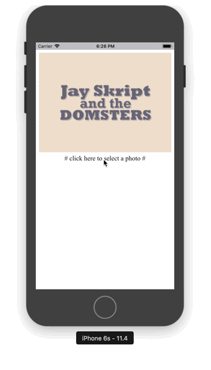

## Find inspiration in practice

### RouterPattern
> Practice  `mobile-side``front-end` `back-end``three-end interaction` to implementation a `degraded architecture`.

##### Get Started

- First, you need a [node](https://nodejs.org/en/) server environment
- Then, run the following command to launch server

```
$ cd server/RouterPattern
$ npm start
```

```
$ cd server/RouterPattern/public/javascripts
$ node image.js
```

```
$ cd web/RouterPattern
$ npm run dev
```

##### Contents

- `app` >>> Practice `Swift` as a mobile-end development language
- `web` >>> Practice `Vue` as a front-end development framework
- `server` >>> Practice `Koa` as a back-end development framework

##### Display


Completed a `degradable architecture`, just call the `back-end interface`, the client automatically downgrades from `native` to `webpage`.

##### Article

- [Hybird 搭建零耦合架构从MVC开始](https://coderzsq.github.io/2017/04/Hybird-%E6%90%AD%E5%BB%BA%E9%9B%B6%E8%80%A6%E5%90%88%E6%9E%B6%E6%9E%84%E4%BB%8EMVC%E5%BC%80%E5%A7%8B/)
- [Hybird 搭建后端Koa.js并过度到MVVM](https://coderzsq.github.io/2017/04/Hybird-%E6%90%AD%E5%BB%BA%E5%90%8E%E7%AB%AFKoa.js%E5%B9%B6%E8%BF%87%E5%BA%A6%E5%88%B0MVVM/)
- [Hybird 搭建前端Vue.js并升级至MVP](https://coderzsq.github.io/2017/04/Hybird-%E6%90%AD%E5%BB%BA%E5%89%8D%E7%AB%AFVue.js%E5%B9%B6%E5%8D%87%E7%BA%A7%E8%87%B3MVP/)
- [Hybird 搭建路由Router实现组件化](https://coderzsq.github.io/2017/04/Hybird-%E6%90%AD%E5%BB%BA%E8%B7%AF%E7%94%B1Router%E5%AE%9E%E7%8E%B0%E7%BB%84%E4%BB%B6%E5%8C%96/)
- [Hybird 搭建客户端实时降级架构](https://coderzsq.github.io/2017/04/Hybird-%E6%90%AD%E5%BB%BA%E5%AE%A2%E6%88%B7%E7%AB%AF%E5%AE%9E%E6%97%B6%E9%99%8D%E7%BA%A7%E6%9E%B6%E6%9E%84/)


### PhotoGallery
> Practice the `interaction` logic between `mobile-end` and `front-end`.

##### Contents
- `UIWebView` >>> use UIWebView to implement `HTML` to call `native` album function

##### Display


##### Article
- [Hybird 说说与Web交互的那些事儿](https://coderzsq.github.io/2017/01/Hybird-%E8%AF%B4%E8%AF%B4%E4%B8%8EWeb%E4%BA%A4%E4%BA%92%E7%9A%84%E9%82%A3%E4%BA%9B%E4%BA%8B%E5%84%BF/)